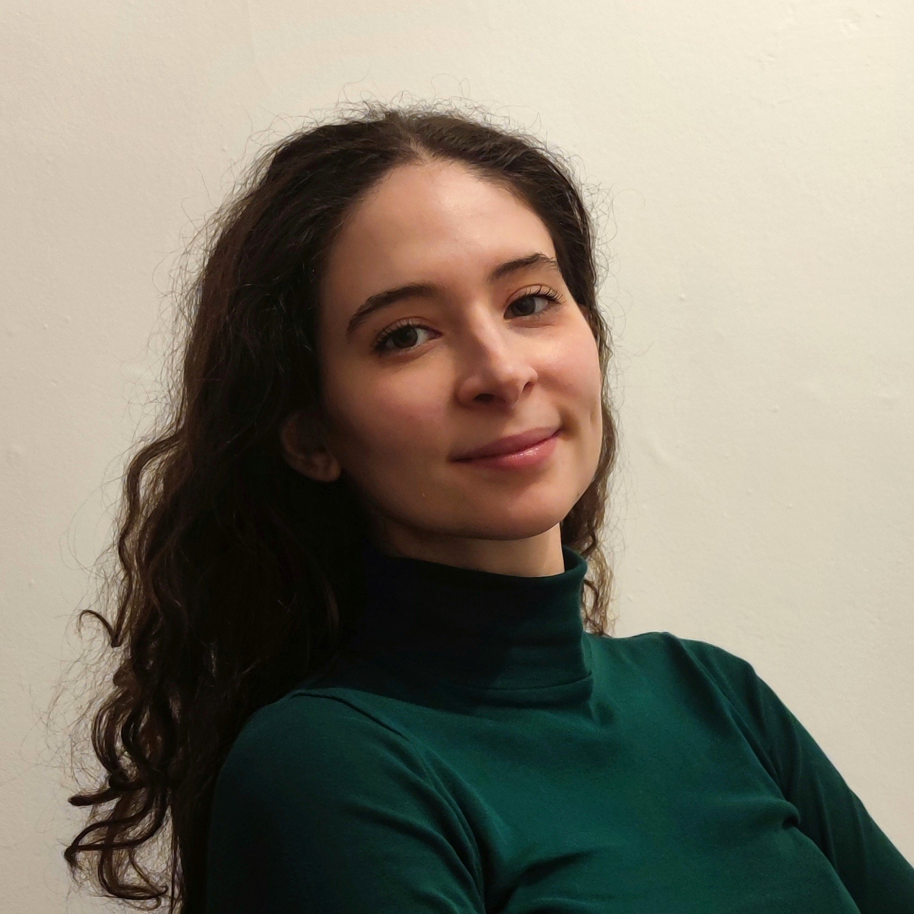

  
  <!-- LEFT COLUMN: Image and Name -->
  

    
    

<h2 style="margin-top: 0;">📫 Contact &amp; Links</h2>

  
  
  
  

  

  <!-- RIGHT COLUMN: Bio, Publications, Projects, Contact -->
  

    
    
I am a PhD student in Brain, Mind and Computer Science at the Department of Mathematics of the <a href="http://unipd.it/en" target="_blank">University of Padova</a>, affiliated to the <a href="http://vimp.math.unipd.it/index.html" target="_blank">Visual Intelligence and Machine Perception (VIMP) group</a> at the University of Padova and to the <a href="https://mobs.fbk.eu/" target="_blank">Mobile and Social Computing Lab (MobS) group</a> at Fondazione Bruno Kessler.

    
    
My research interests include computer vision for video understanding, multi-agent cooperation in embodied AI, and neuroscience-inspired systems. 🤖

    
    
Previously, I graduated in both Physics of Data and Physics at the University of Padova, Italy. This experience has allowed me to develop a strong analytical approach to problem-solving and a curious mind. ⏳

   

<h2 style="margin-top: 0;">📝 Publications & Experience</h2>

<strong>PhD Student</strong> — University of Padova &amp; Fondazione Bruno Kessler <em>(Current)</em>

<strong>Research Intern</strong> — SAILab &amp; VIMP Group, University of Siena and University of Padova

<ul>
  <li>Worked on action progress prediction in videos: <a href="https://arxiv.org/abs/2603.00151" target="_blank">Multiview Progress Prediction of Robot Activities, ICASSP 2026</a>.</li>
</ul>

<h2>💻 Featured Projects</h2>

You can find a complete collection of my projects during my MSc in Physics of Data <a href="projects.md">here</a>.

